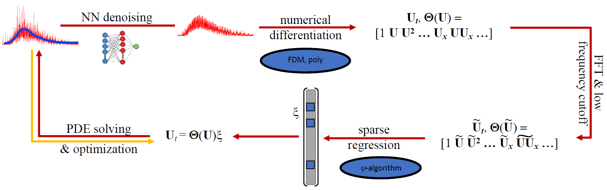

# PSI-PDE
A robust method of learning PDEs from dynamical systems.

Copyright Notice:

Authors: Zhiming Zhang zzhan506@asu.edu; Yongming Liu yongming.liu@asu.edu

Prognostic Analysis and Reliability Assessment Lab, Arizona State University. https://paralab.engineering.asu.edu/
